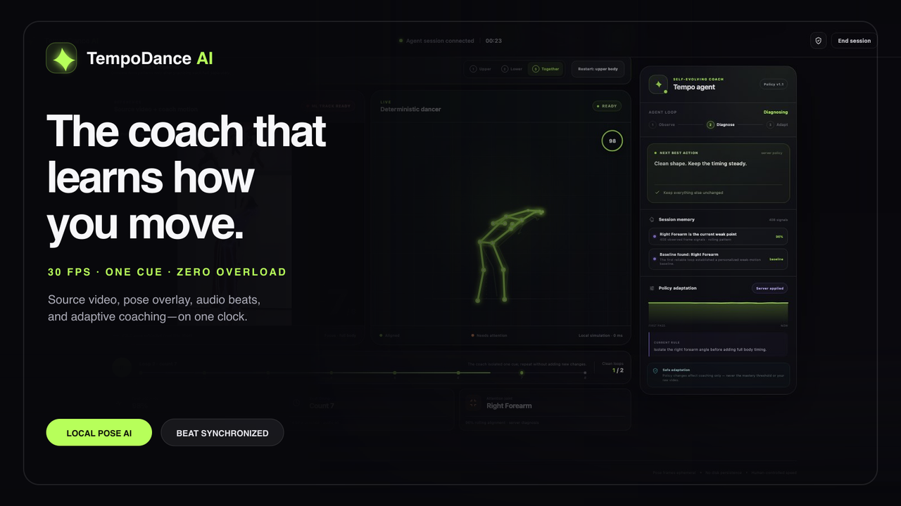

# TempoDance AI

[](https://youtu.be/l5TPZ2Bd-HI)

**[▶ Watch the demo on YouTube](https://youtu.be/l5TPZ2Bd-HI)** · **[Launch the demo-only Vercel build](https://tempodance-ai.vercel.app)**

TempoDance AI is a self-evolving dance coach. It compares a learner's body geometry with a source-synchronized tutorial pose, identifies the lowest-scoring tracked limb, and evaluates its coaching focus after each completed server-side loop.

The current hackathon build is deliberately demo-safe:

- **Demo mode works with no API key, model download, or camera.**
- **The documented live setup runs pose inference locally** with Ultralytics and Apple MPS when available.
- **The coaching policy evolves from measured errors**, with visible memory and policy versions.
- **Automatic progression requires two qualifying loops** at each tier: `0.25x`, `0.5x`, `0.6x`, `0.8x`, and `1.0x`. Manual controls remain available.
- **Cloud routine planning is optional.** A Fireworks adapter accepts caller-supplied frame images, while scoring and coaching remain deterministic.
- **The supplied YouTube Short is packaged locally with audio.** Its lower tutorial coach was processed into a source-rate 30 FPS COCO-17 pose track, so the purple overlay and source video share one playback clock.
- **Practice can be step-by-step or full-routine.** Step-by-step isolates upper body, lower body, then the combined move; only the selected region is rendered and scored. Full routine enables the complete movement immediately.
- **Live camera motion targets 20 pose updates per second** from a requested 30 FPS camera stream, up from the original ~5 FPS throttle.

## Run it now

Open the **[hosted demo](https://tempodance-ai.vercel.app)** for the deterministic no-camera experience only. For the full product, clone this repo and run it locally with the API and optional camera path below.

From this directory:

```bash
./run.sh
```

Then open [http://localhost:8000](http://localhost:8000), leave **Demo mode** selected, and press the circular play button. Use the camera path only after the no-camera flow is working.

The reference panel plays the locally packaged copy of `https://www.youtube.com/shorts/jrUsvBKemBU` with its audio and extracted pose overlay. Leave **Step by step** selected and use **Next** to move from upper body to lower body, then to the combined move—or select **Full routine** to practice everything immediately.

The copied virtual environment has stale shell-script shebangs because the folder moved. Invoking tools as `./venv/bin/python -m ...` avoids that problem. To rebuild it cleanly later:

```bash
python3 -m venv .venv
./.venv/bin/python -m pip install -r backend/requirements.txt
./.venv/bin/python -m uvicorn backend.main:app --reload --port 8000
```

## Verify

```bash
./venv/bin/python -m unittest discover -s tests -v
curl -s http://127.0.0.1:8000/api/health
```

## Optional Fireworks routine plan

Copy `.env.example` to `.env`, redeem any event coupon through the sponsor flow, paste the **actual API key** into `FIREWORKS_API_KEY`, and set `TEMPO_ANALYZER_PROVIDER=fireworks`. A coupon code is not a bearer credential. The current browser does not supply tutorial frames or render the returned plan; use the smoke test in [docs/SPONSOR_SETUP.md](docs/SPONSOR_SETUP.md) before claiming this integration.

## What is real in the demo

The no-camera demo uses scripted learner perturbations and a browser cosine scorer against the real extracted tutorial track. With the local API connected, its score and per-bone values feed the real server-side policy and mastery session; without the API, a scripted learner fallback keeps the walkthrough usable. Live camera frames are scored in Python. Reference landmarks come from YOLO inference over the supplied tutorial; video time is the shared synchronization clock.

In the documented localhost setup, webcam JPEGs go to the local FastAPI process for in-memory inference and are not persisted by application code. A hosted or overridden API sends frames to that configured server. Policy state lives in server memory and is not written to disk.

## Rebuild the tutorial assets

The committed browser assets can be regenerated from the source URL with `yt-dlp`, FFmpeg, and the local Ultralytics pose model:

```bash
./venv/bin/python scripts/process_tutorial.py --model yolo11n-pose.pt
```

The script downloads into a temporary directory, transcodes the source to browser-compatible H.264/AAC, crops inference to the lower tutorial coach, and writes the local MP4 plus COCO-17 pose JSON to `frontend/assets/`.

## Judge-demo state


- [29-second male-voiced demo with source audio](artifacts/tempodance-demo-voiced.mp4)
- [29-second voice-only fallback](artifacts/tempodance-demo-voiced-clean.mp4)
- [Silent editable screen-recording master](artifacts/tempodance-demo-raw.mp4)
- [YouTube/X upload copy and final media checklist](docs/UPLOAD_COPY.md)

See [SUBMISSION.md](SUBMISSION.md) for copy, the three-minute pitch, demo recovery, and the two hackathon angles.
