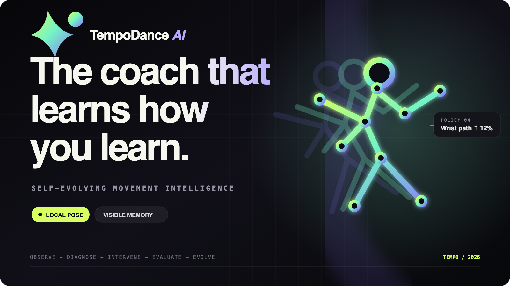
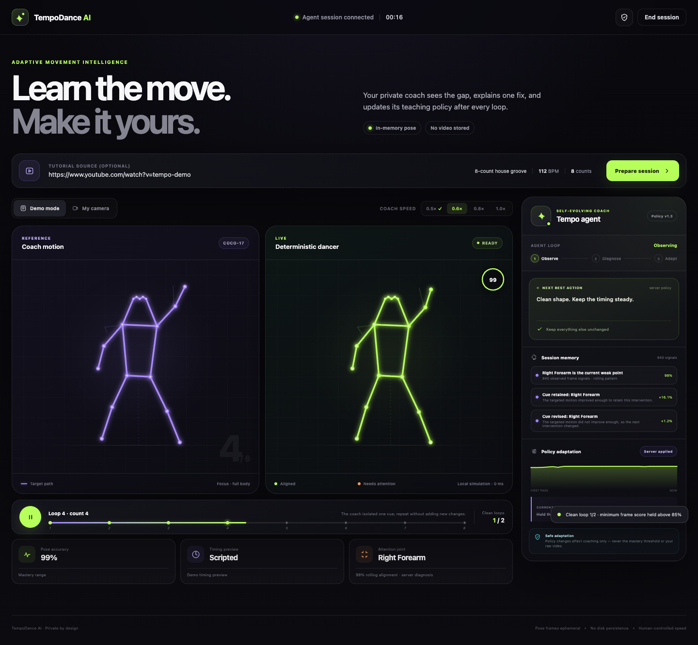

# TempoDance AI



TempoDance AI is a self-evolving dance coach. It compares a learner's body geometry with a built-in animated eight-count, identifies the lowest-scoring tracked limb, and evaluates its coaching focus after each completed server-side loop.

The current hackathon build is deliberately demo-safe:

- **Demo mode works with no API key, model download, or camera.**
- **The documented live setup runs pose inference locally** with Ultralytics and Apple MPS when available.
- **The coaching policy evolves from measured errors**, with visible memory and policy versions.
- **Automatic progression requires two qualifying loops** at each tier: `0.5x`, `0.6x`, `0.8x`, and `1.0x`. Manual controls remain available.
- **Cloud routine planning is optional.** A Fireworks adapter accepts caller-supplied frame images, while scoring and coaching remain deterministic.

## Run it now

From this directory:

```bash
./run.sh
```

Then open [http://localhost:8000](http://localhost:8000), leave **Demo mode** selected, and press the circular play button. Use the camera path only after the no-camera flow is working.

The copied virtual environment has stale shell-script shebangs because the folder moved. Invoking tools as `./venv/bin/python -m ...` avoids that problem. To rebuild it cleanly later:

```bash
python3 -m venv .venv
./.venv/bin/python -m pip install -r backend/requirements.txt
./.venv/bin/python -m uvicorn backend.main:app --reload --port 8000
```

## Verify

```bash
./venv/bin/python -m unittest discover -s tests -v
curl -s http://127.0.0.1:8000/api/health
```

## Optional Fireworks routine plan

Copy `.env.example` to `.env`, redeem any event coupon through the sponsor flow, paste the **actual API key** into `FIREWORKS_API_KEY`, and set `TEMPO_ANALYZER_PROVIDER=fireworks`. A coupon code is not a bearer credential. The current browser does not supply tutorial frames or render the returned plan; use the smoke test in [docs/SPONSOR_SETUP.md](docs/SPONSOR_SETUP.md) before claiming this integration.

## What is real in the demo

The no-camera demo uses scripted landmark perturbations and a browser cosine scorer. With the local API connected, its score and per-bone values feed the real server-side policy and mastery session; without the API, a scripted UI fallback keeps the walkthrough usable. Live camera frames are scored in Python. The current build uses a built-in COCO-17 reference; tutorial landmark extraction and beat alignment are roadmap work.

In the documented localhost setup, webcam JPEGs go to the local FastAPI process for in-memory inference and are not persisted by application code. A hosted or overridden API sends frames to that configured server. Policy state lives in server memory and is not written to disk.

## Judge-demo state



See [SUBMISSION.md](SUBMISSION.md) for copy, the three-minute pitch, demo recovery, and the two hackathon angles.
